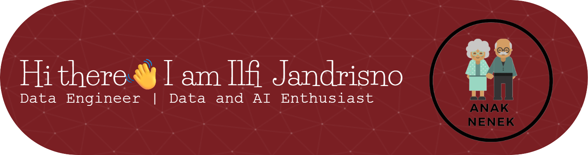

<!--
**ilfijandrisno/ilfijandrisno** is a ✨ _special_ ✨ repository because its `README.md` (this file) appears on your GitHub profile.

Here are some ideas to get you started:

- 🔭 I’m currently working on ...
- 🌱 I’m currently learning ...
- 👯 I’m looking to collaborate on ...
- 🤔 I’m looking for help with ...
- 💬 Ask me about ...
- 📫 How to reach me: ...
- 😄 Pronouns: ...
- ⚡ Fun fact: ...
-->

#### SUMMARY
Experienced IT professional with a strong background in management information systems (MIS), data engineering, and business intelligence. Proven expertise in ETL processes, data warehousing, analytics, budgeting, and activity-based costing. Skilled in designing interactive dashboards that enhance decision-making and reduce analysis time.

- 🔭 Currently working as Data Engineer
- 📄 My CV: [View CV](https://github.com/ilfijandrisno/ilfijandrisno/raw/main/files/CV_Ilfi_Jandrisno.pdf)
- 🌐 LinkedIn: [linkedin.com/in/ilfijandrisno](https://linkedin.com/in/ilfijandrisno)
- 🧰 Tech: Python | SQL Server | SSIS | Tableau | AWS

##### Tech Stack
  

##### Connect With Me
 

##### Stats

